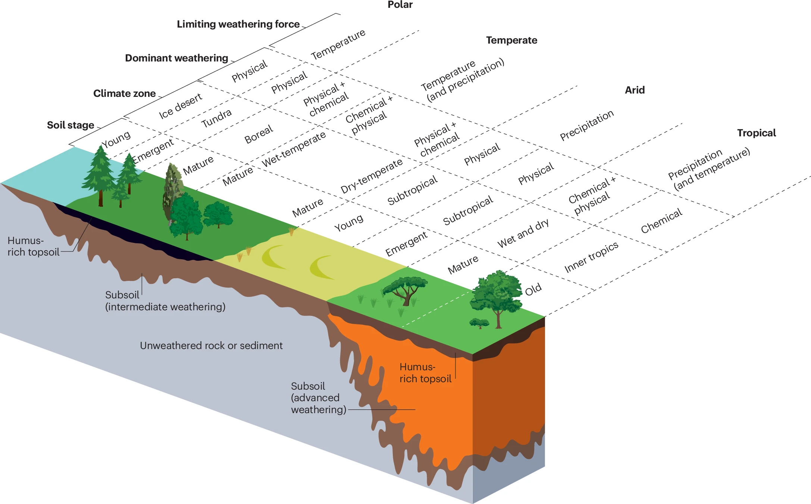

<!--
**vmyrgiotis/vmyrgiotis** is a ✨ _special_ ✨ repository because its `README.md` (this file) appears on your GitHub profile.

Here are some ideas to get you started:

- 🔭 I’m currently working on ...
- 🌱 I’m currently learning ...
- 👯 I’m looking to collaborate on ...
- 🤔 I’m looking for help with ...
- 💬 Ask me about ...
- 📫 How to reach me: ...
- 😄 Pronouns: ...
- ⚡ Fun fact: ...
-->

## About Me

Hello there! My name is Vasilis and I am a research scientist at the [UK Centre for Ecology and Hydrology](https://www.ceh.ac.uk). My work is aimed at quantifying and monitoring ecosystem functioning. I have more than 12 years of experience in the development of process and data-driven models that describe biogeochemical processes in terrestrial ecosystems. I also have a keen interest in ecosystem sensing technology. You can see my CV [here](cv.md) and some examples of my work below.

Main research interests:
* Agro-ecosystems
* Soil science and ecosystem biogeochemistry
* Computational data science
* Ecosystem modelling
* Earth observation and remote sensing 

## Portfolio

 Grassland Modelling 

  
### Grassland Modelling

DALEC-Grass is a simple process-based model that simulates carbon (C) dynamics in temperate grassland ecosystems using 5 C pools: leaf, stem, roots, litter and soil organic C. C is assimilated into biomass via photosynthesis and allocated to the 5 C pools directly (biomass) or indirectly (soil). Vegetation removals can occur due to grazing or cutting. When grazing occurs the model quantifies how much of the grazed biomass-C returns to the soil as manure, is emitted a CO2 and CH4 and how much is stored in animal body. [DALEC-Grass](https://github.com/vmyrgiotis/DALEC_Grass) is written in fortran and can be compiled into a shared object for use in python. DALEC-Grass belongs to the DALEC (Data Assimilation Linked Ecosystem Carbon) family of models that are developed in the [Global Change Ecology Lab](https://github.com/GCEL) of the University of Edinburgh (UK). 

 Model Data Fusion  

  
### Model Data Fusion 

Data fusion is the process of integrating multiple data sources to produce more consistent, accurate, and useful information than that provided by any individual data source. In Model-Data Fusion (MDF) one data stream includes model-simulated variables while other data streams contain observations of system drivers (climate, soil conditions) and of system behaviour (plant growth). In ecosystem science, MDF refers to the use of earth observation and ground measured data on ecosystem functioning e.g. plant physiology, soil moisture/temperature, greenhouse gas fluxes etc. 

 Soil Carbon Modelling 

  
### Soil Carbon Modelling 

Soil plays key role for the health and functioning of terrestrial ecosystem. It is also a critical carbon pool whose size exceeds the carbon stored in the atmosphere and vegetation combined. Soil carbon models are tools used to simulate and predict the dynamics of carbon in soil. Some soil carbon models are standalone models and others are modules of ecosystem scale models. This [repository](https://github.com/vmyrgiotis/soilCmodelling) includes python code and notebooks for implementing some widely-used soil carbon models available. 

 Earth Observation 

### Earth Observation 

<!-- 
 
--> 

tba... 

